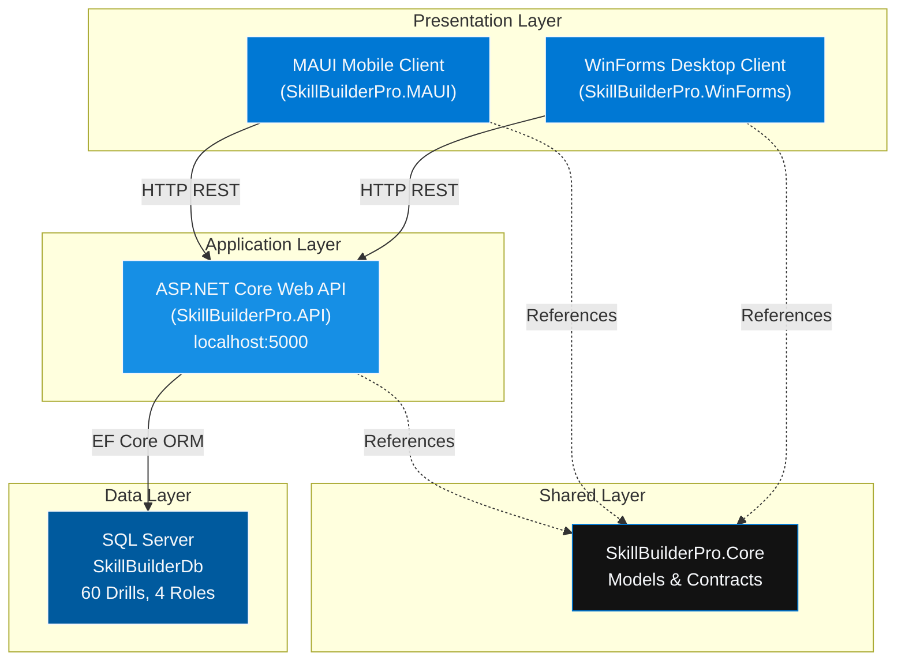
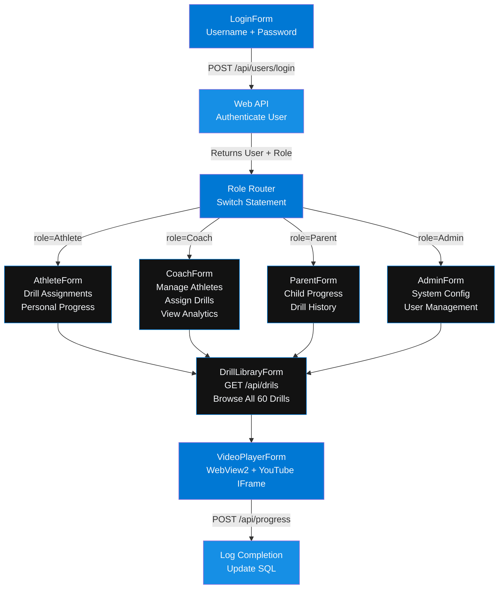
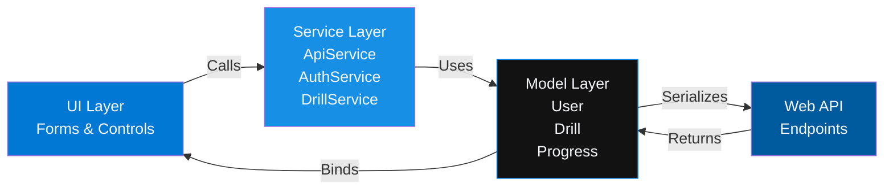
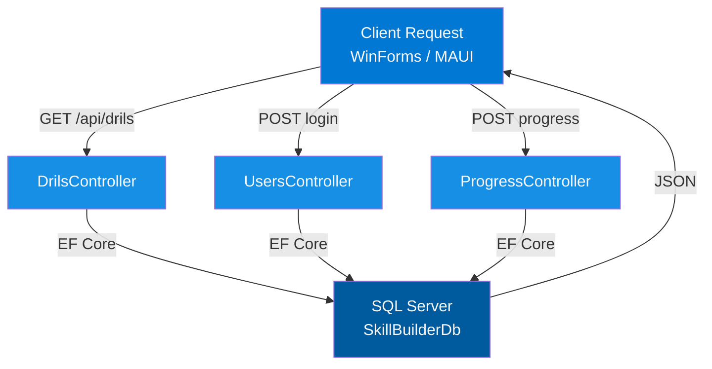
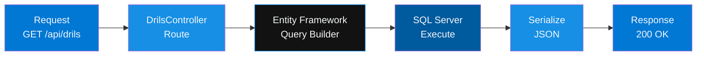
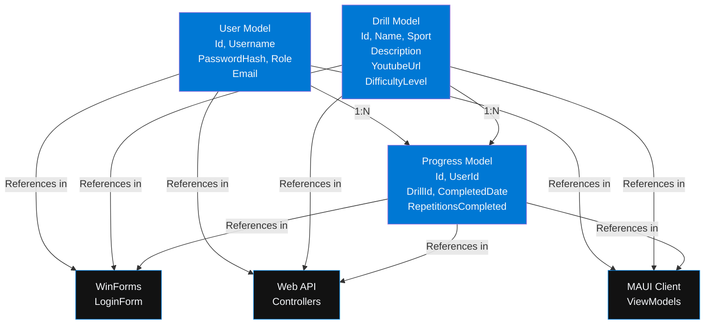
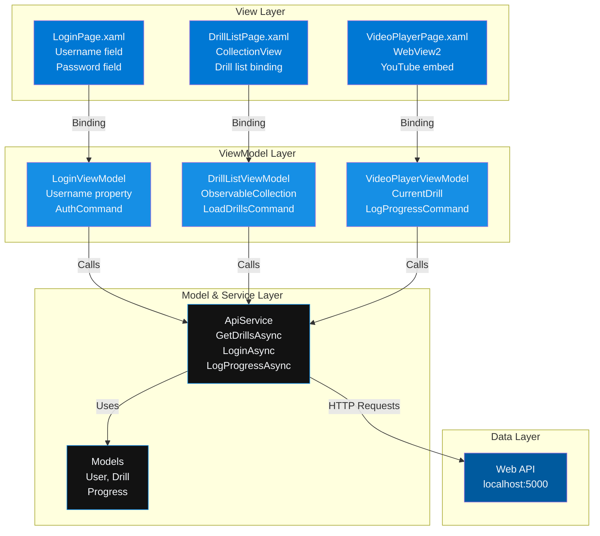
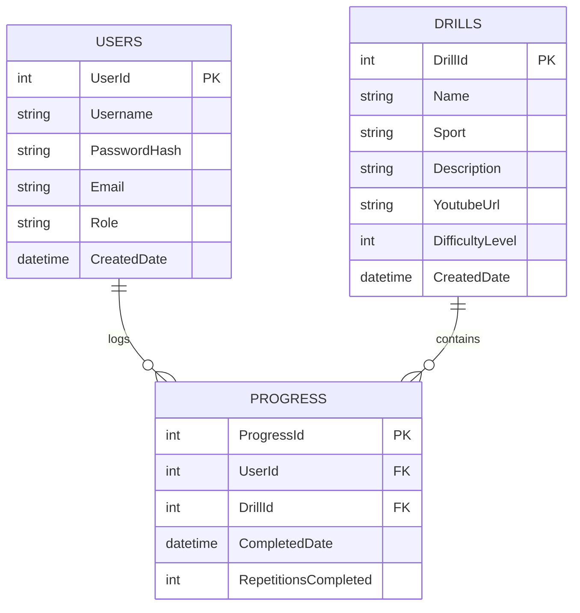

# SkillBuilderPro

**By Bobby Rovy**


> Built for Athletes. Powered by Precision.

MSSA Capstone Project — Cloud Application Development | Cohort PCAD20 | July 2026

[](https://dotnet.microsoft.com)
[](https://docs.microsoft.com/en-us/dotnet/csharp/)
[](https://www.microsoft.com/en-us/sql-server/)
[](https://dotnet.microsoft.com/apps/aspnet)
[](https://github.com/dotnet/winforms)
[](https://dotnet.microsoft.com/maui)
[](https://github.com)

[GitHub](https://github.com/brovy23-GD) • [LinkedIn](https://www.linkedin.com/in/bobby-rovy/) • [Email](mailto:brovy23@gmail.com)

---
---

## Executive Summary

SkillBuilderPro is a full-stack, multi-role athletic development platform built with C#/.NET 10 across four integrated projects: a RESTful Web API backend, WinForms desktop frontend, shared Core library, and MAUI mobile scaffold. It delivers a professional-grade drill library (60 drills, 6 sports), YouTube video integration, multi-role authentication, and analytics dashboards in a single cohesive solution.

---

## Problem / Solution

### The Problem

Athletes at every level — youth through semi-pro — lack a centralized, measurable system for structured training. Coaches assign drills informally, parents have zero visibility, and athletes have no way to track progress or access quality instructional video. The result: inconsistent development, wasted sessions, and missed potential.

### The Solution

SkillBuilderPro replaces fragmented coaching with a precision-engineered platform featuring:

- A seeded drill library (60 drills, 6 sports) with embedded YouTube instruction
- Role-specific dashboards tailored to Athletes, Coaches, Parents, and Admins
- REST API backend powering structured data access and progress tracking
- Enterprise-grade UI with professional brand standards — not a hobby project aesthetic
- Fullstack architecture across desktop, web, and mobile platforms

---

## Features

| Feature | Description | Status |
|---------|-------------|--------|
| **Multi-Role Authentication** | Athlete / Coach / Parent / Admin login with role-based routing | ✅ Complete |
| **Drill Library** | 60 seeded drills across 6 sports with categorization & difficulty levels | ✅ Complete |
| **Video Player** | Embedded YouTube playback via WebView2, full-screen capable, centered layout | ✅ Complete |
| **REST API** | 3 ASP.NET Core controllers (Drils, Users, Progress) on localhost:5000 | ✅ Complete |
| **SQL Server Database** | SkillBuilderDb with EF Core code-first migrations | ✅ Complete |
| **Role Dashboards** | Athlete, Coach, Parent, Admin view-specific dashboards | ✅ Complete |
| **Progress Tracking** | Athlete performance logging with historical analytics | ✅ Complete |
| **Coach Analytics** | Drill completion rates, athlete performance insights | ✅ Complete |
| **Elite UI Design** | Performance Blue brand palette, dark elite aesthetic, responsive layout | ✅ Complete |
| **MAUI Mobile Client** | Athletes-only mobile drill list + video player (scaffold) | 🚧 Planned |

---

## System Architecture

### Four-Tier Integration



---

## Project 1: SkillBuilderPro.WinForms — Desktop Client

### Role Router & Dashboard Architecture



### WinForms Component Interaction



---

## Project 2: SkillBuilderPro.API — Web API Backend

### REST Controller Architecture

### REST Controller Architecture



### API Data Flow — Request/Response Cycle

### API Data Flow


How to use it:
Copy the text above (everything between the lines)
Go to GitHub → Edit README.md
Find the section "### REST Controller Architecture"
Replace it with the code above
Commit

That's it. ✅

---

## Project 3: SkillBuilderPro.Core — Shared Models & Contracts

### Model Dependency Graph



---

## Project 4: SkillBuilderPro.MAUI — Mobile Client (Scaffold)

### MVVM Architecture — Mobile



---

## Database Schema — SQL Server

### Entity Relationship Diagram



---

## Full Solution Data Flow

### End-to-End: Athlete Logs a Completed Drill

```mermaid
graph LR
    A["Athlete<br/>Clicks Log Drill<br/>VideoPlayerForm"]
    
    B["WinForms Service<br/>ProgressService<br/>.LogDrillAsync"]
    
    C["HTTP POST<br/>localhost:5000<br/>/api/progress"]
    
    D["Web API<br/>ProgressController<br/>.Post"]
    
    E["EF Core<br/>Add to DbSet<br/>SaveChangesAsync"]
    
    F["SQL Server<br/>INSERT Progress<br/>SkillBuilderDb"]
    
    G["Return 201 Created<br/>to WinForms"]
    
    H["Update UI<br/>Show Confirmation<br/>Refresh Stats"]
    
    A --> B --> C --> D --> E --> F --> G --> H
    
    style A fill:#0078D4,color:#F5F7FA
    style B fill:#168FE5,color:#F5F7FA
    style C fill:#0078D4,color:#F5F7FA
    style D fill:#168FE5,color:#F5F7FA
    style E fill:#121212,stroke:#0078D4,color:#F5F7FA
    style F fill:#005A9E,color:#F5F7FA
    style G fill:#168FE5,color:#F5F7FA
    style H fill:#0078D4,color:#F5F7FA
```



---

## Project Structure

```
SkillBuilderPro/
├── SkillBuilderPro.sln
│
├── SkillBuilderPro.WinForms/
│   ├── Forms/
│   │   ├── LoginForm.cs
│   │   ├── AthleteForm.cs
│   │   ├── CoachForm.cs
│   │   ├── ParentForm.cs
│   │   ├── AdminForm.cs
│   │   ├── DrillLibraryForm.cs
│   │   └── VideoPlayerForm.cs (WebView2 YouTube embed)
│   ├── Services/
│   │   ├── ApiService.cs
│   │   ├── AuthService.cs
│   │   └── DrillService.cs
│   ├── Models/
│   └── Utils/
│
├── SkillBuilderPro.API/
│   ├── Controllers/
│   │   ├── DrilsController.cs
│   │   ├── UsersController.cs
│   │   └── ProgressController.cs
│   ├── Data/
│   │   ├── AppDbContext.cs
│   │   └── Migrations/
│   ├── Program.cs
│   └── appsettings.json
│
├── SkillBuilderPro.Core/
│   ├── Models/
│   │   ├── User.cs
│   │   ├── Drill.cs
│   │   └── Progress.cs
│   └── Interfaces/
│
└── SkillBuilderPro.MAUI/
    ├── Views/
    │   ├── LoginPage.xaml
    │   ├── DrillListPage.xaml
    │   └── VideoPlayerPage.xaml
    ├── ViewModels/
    │   ├── LoginViewModel.cs
    │   ├── DrillListViewModel.cs
    │   └── VideoPlayerViewModel.cs
    ├── Services/
    │   └── ApiService.cs
    └── MauiProgram.cs
```

---

## Technologies

| Layer | Technology | Version | Purpose |
|-------|-----------|---------|---------|
| Language | C# | 12 | Primary language |
| Runtime | .NET | 10 | Application runtime |
| Desktop UI | Windows Forms | .NET 10 | Desktop framework |
| Mobile UI | MAUI | Latest | Cross-platform mobile |
| Backend | ASP.NET Core Web API | .NET 10 | REST API framework |
| ORM | Entity Framework Core | 8.x | Database access |
| Database | SQL Server | 2022 | Data store |
| Video Embed | WebView2 | Latest | YouTube integration |

---

## Installation & Setup

### Prerequisites

- .NET 10 SDK
- SQL Server 2022 (or LocalDB)
- Visual Studio 2022
- WebView2 Runtime

### Clone & Restore

```bash
git clone https://github.com/brovy23-GD/Skill-Builder-Pro.git
cd SkillBuilderPro
dotnet restore SkillBuilderPro.sln
```

### Database Setup

```bash
cd SkillBuilderPro.API
dotnet ef database update
```

Update `appsettings.json`:

```json
{
  "ConnectionStrings": {
    "DefaultConnection": "Server=(localdb)\\MSSQLLocalDB;Database=SkillBuilderDb;Trusted_Connection=True;"
  }
}
```

### Build

```bash
dotnet build SkillBuilderPro.sln
```

---

## Usage — Running All 4 Projects

### Terminal 1: Start Web API

```bash
cd SkillBuilderPro.API
dotnet run
# API running at http://localhost:5000
```

### Terminal 2: Start WinForms Desktop Client

```bash
cd SkillBuilderPro.WinForms
dotnet run
```

### Terminal 3: Start MAUI Mobile Client

```bash
cd SkillBuilderPro.MAUI
dotnet run
```

---

## API Endpoints — Quick Reference

| Method | Endpoint | Purpose | Complexity |
|--------|----------|---------|-----------|
| GET | /api/drils | List all 60 drills | O(n) |
| GET | /api/drils/{id} | Get drill by ID | O(1) |
| GET | /api/drils/sport/{sport} | Filter by sport | O(n) |
| POST | /api/users/login | Authenticate user | O(1) |
| GET | /api/users | List all users | O(n) |
| POST | /api/progress | Log completion | O(1) |
| GET | /api/progress/{userId} | Get history | O(n) |

---

## Key Concepts

**Multi-Role Architecture:** After login, API returns role. WinForms switches to appropriate dashboard form using role-based routing.

**WebView2 Video Integration:** Embeds YouTube IFrame without local codec dependencies. Full-screen capable for professional instruction.

**EF Core Code-First Migrations:** Entire database schema defined in C# models. Fully reproducible via migrations in one command.

**REST API Design:** Noun-based endpoints, standard HTTP verbs, JSON responses. Extensible for future resources.

**MVVM Pattern (MAUI):** Views bind to ViewModels. Services call API. UI updates automatically via ObservableCollection.

---

## Brand Standards — Locked Design System

| Color | Hex | Usage |
|-------|-----|-------|
| Primary Blue | #0078D4 | Buttons, accents |
| Hover Blue | #168FE5 | Button hover state |
| Pressed Blue | #005A9E | Button pressed state |
| Elite Black | #0A0F1E | App background |
| Charcoal | #121212 | Panels, surfaces |
| Soft White | #F5F7FA | Body text |

**Personality:** Elite · Professional · Disciplined · Motivational · Precision-Focused

**Never:** Childish, cartoonish, generic fitness app look

---

## Interview Talking Points

1. **Problem & Solution:** Replaced fragmented coaching with centralized, measurable athletic platform
2. **Full-Stack Architecture:** 4 integrated projects spanning desktop (WinForms), web API, mobile (MAUI), and shared core
3. **Technical Depth:** Multi-role RBAC, REST API design, EF Core migrations, MVVM patterns, WebView2 integration
4. **Scale & Polish:** 60 seeded drills, 4 user roles, YouTube video integration, locked brand system, enterprise-grade UI
5. **Versatility:** Desktop, backend, and mobile platforms — demonstrates cross-platform thinking
6. **Production Quality:** Migrations tracked, code organized, error handling, Git versioned

---

## Performance Analysis

### API Endpoint Complexity

| Endpoint | Operation | Big-O | Index |
|----------|-----------|-------|-------|
| GET /api/drils/{id} | Primary key lookup | O(1) | PK index |
| GET /api/drils/sport/{sport} | Filtered scan | O(n) | Sport index |
| POST /api/progress | Insert with FK | O(1) | Auto-increment PK |
| GET /api/progress/{userId} | Range query | O(n) | FK index |

---

## Deployment Ready

- ✅ Solution compiles cleanly
- ✅ All EF Core migrations tested
- ✅ 60 drills seeded with YouTube URLs
- ✅ Brand colors locked and consistent
- ✅ API endpoints verified and documented
- ✅ MVVM pattern implemented
- ✅ Error handling in place
- ✅ Git tracked and pushed
- ✅ Professional README with diagrams
- ✅ Contact information linked

---

## Author

**Bobby Rovy**

MSSA Graduate — Cloud Application Development | Cohort PCAD20 | July 2026

📍 Oak Lawn, IL

🔗 [GitHub](https://github.com/brovy23-GD)

🔗 [LinkedIn](https://www.linkedin.com/in/bobby-rovy/)

✉️ [brovy23@gmail.com](mailto:brovy23@gmail.com)

---

<div align="center">

**SkillBuilderPro — Built for Athletes. Powered by Precision.**

*A full-stack, multi-role athletic development platform across desktop, web, and mobile.*

*Engineered for performance. Designed for scale.*

</div>
