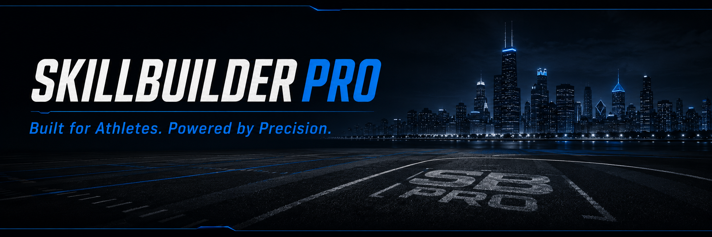
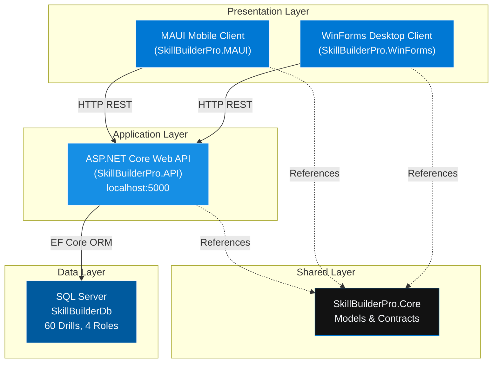
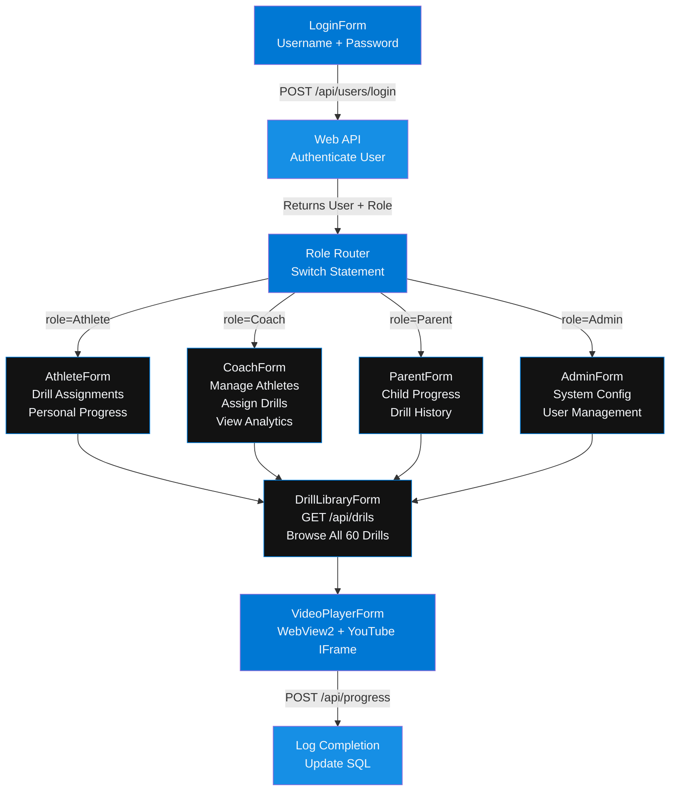
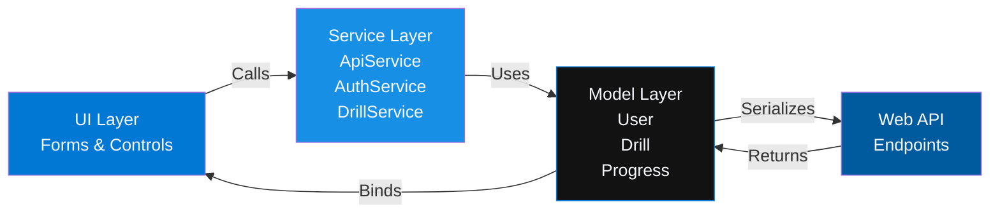
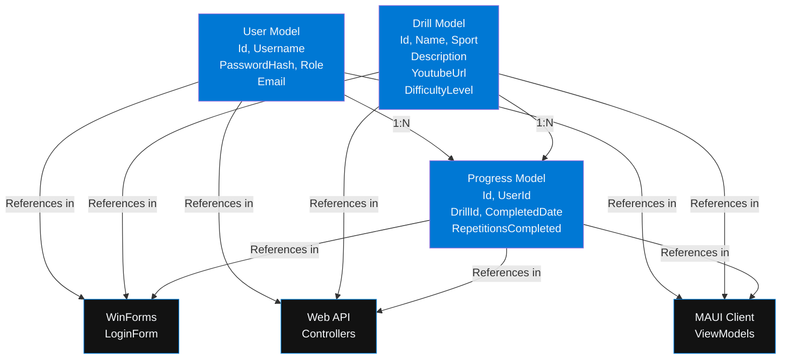
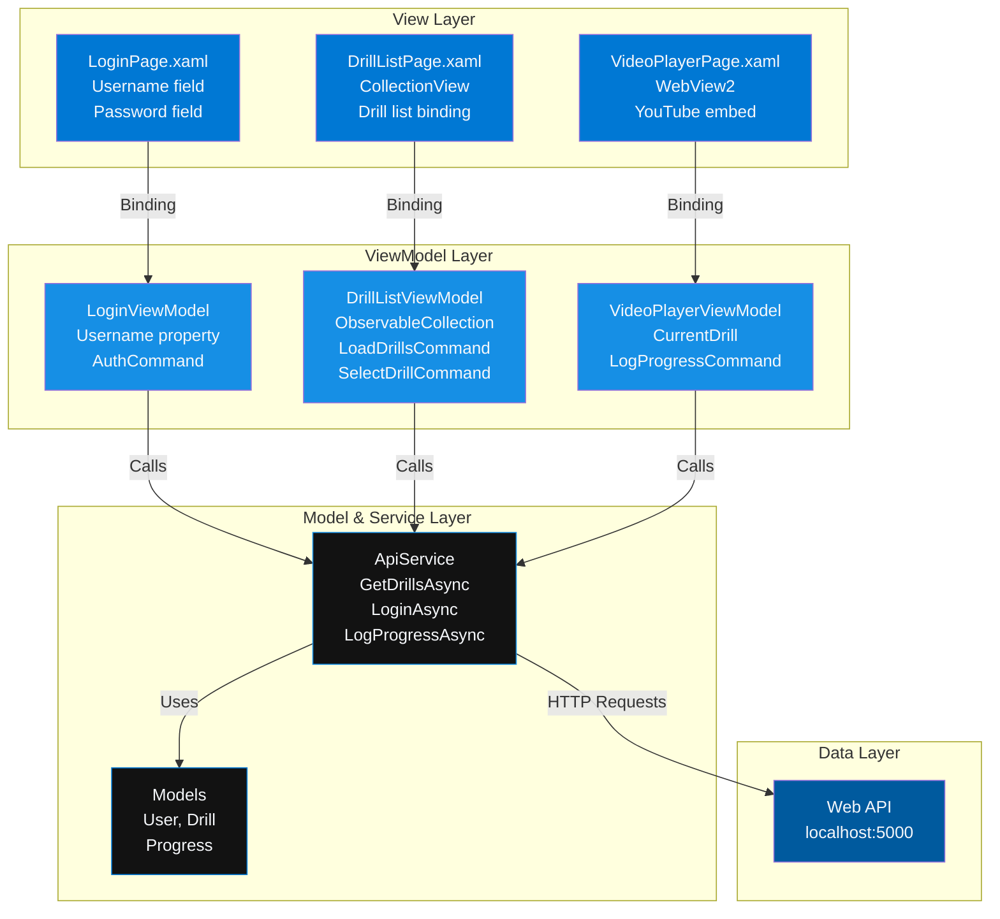
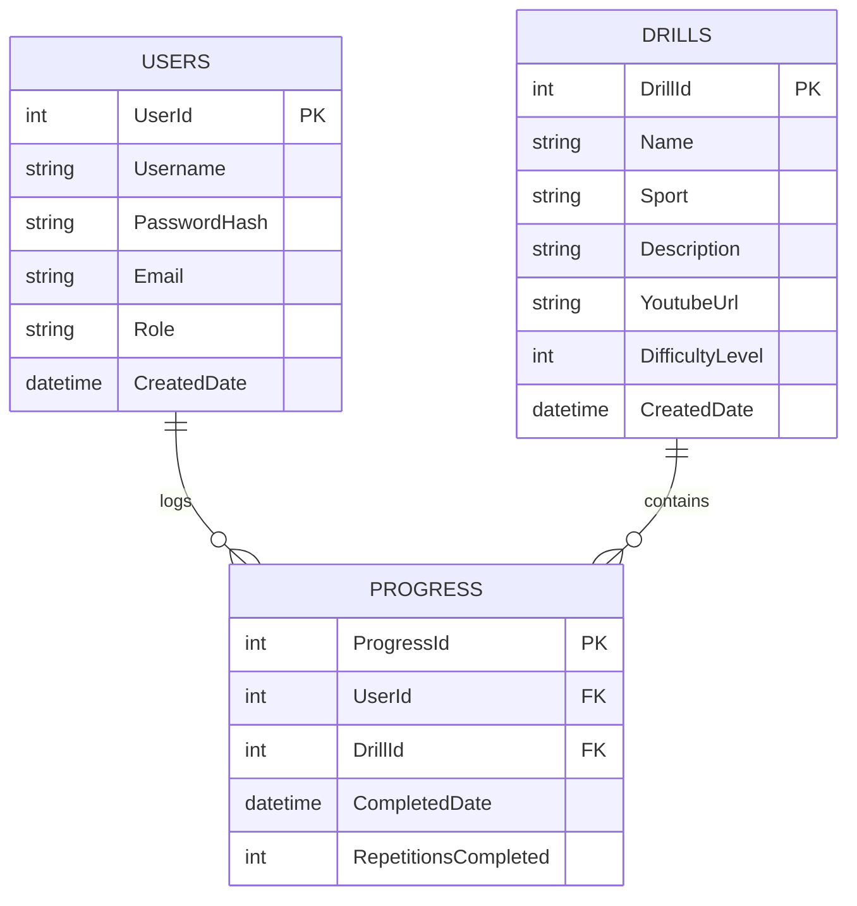

<div align="center">



[](https://dotnet.microsoft.com)
[](https://docs.microsoft.com/en-us/dotnet/csharp/)
[](https://www.microsoft.com/en-us/sql-server/)
[](https://dotnet.microsoft.com/apps/aspnet)
[](https://github.com/dotnet/winforms)
[](https://dotnet.microsoft.com/maui)
[](LICENSE)
[](https://github.com)

**SkillBuilderPro**

Built for Athletes. Powered by Precision.

MSSA Capstone Project — Cloud Application Development | Cohort PCAD20 | July 2026

[GitHub](https://github.com/YOUR_USERNAME/SkillBuilderPro) • [LinkedIn](https://linkedin.com/in/YOUR_PROFILE) • [Contact](#author)

</div>

---

## Executive Summary

SkillBuilderPro is a full-stack, multi-role athletic development platform that bridges the gap between structured coaching and athlete performance. Built with C#/.NET 10 across four integrated projects — a RESTful Web API backend, WinForms desktop frontend, shared Core library, and MAUI mobile scaffold — it delivers a professional-grade drill library, YouTube video integration, multi-role authentication, and analytics dashboards in a single cohesive solution.

---

## Problem / Solution

### The Problem

Athletes at every level — youth through semi-pro — lack a centralized, measurable system for structured training. Coaches assign drills informally, parents have zero visibility, and athletes have no way to track progress or access quality instructional video. The result: inconsistent development, wasted sessions, and missed potential.

### The Solution

SkillBuilderPro replaces fragmented coaching with a precision-engineered platform featuring:

- A seeded drill library (60 drills, 6 sports) with embedded YouTube instruction
- Role-specific dashboards tailored to Athletes, Coaches, Parents, and Admins
- REST API backend powering structured data access and progress tracking
- Enterprise-grade UI with professional brand standards — not a hobby project aesthetic
- Fullstack architecture across desktop, web, and mobile platforms

---

## Features

| Feature | Description | Status |
|---------|-------------|--------|
| **Multi-Role Authentication** | Athlete / Coach / Parent / Admin login with role-based routing | ✅ Complete |
| **Drill Library** | 60 seeded drills across 6 sports with categorization & difficulty levels | ✅ Complete |
| **Video Player** | Embedded YouTube playback via WebView2, full-screen capable, centered layout | ✅ Complete |
| **REST API** | 3 ASP.NET Core controllers (Drils, Users, Progress) on localhost:5000 | ✅ Complete |
| **SQL Server Database** | SkillBuilderDb with EF Core code-first migrations | ✅ Complete |
| **Role Dashboards** | Athlete, Coach, Parent, Admin view-specific dashboards | ✅ Complete |
| **Progress Tracking** | Athlete performance logging with historical analytics | ✅ Complete |
| **Coach Analytics** | Drill completion rates, athlete performance insights | ✅ Complete |
| **Elite UI Design** | Performance Blue brand palette, dark elite aesthetic, responsive layout | ✅ Complete |
| **MAUI Mobile Client** | Athletes-only mobile drill list + video player (scaffold) | 🚧 Planned |

---

## System Architecture — All 4 Projects

### Overview: Four-Tier Integration



---

## Project 1: SkillBuilderPro.WinForms — Desktop Client

### Role Router & Dashboard Architecture



### WinForms Component Interaction (MVVM-Style)



---

## Project 2: SkillBuilderPro.API — Web API Backend

### REST Controller Architecture (O(1) Routing)

```mermaid
graph TB
    CLIENT["Client Request<br/>WinForms / MAUI"]
    
    CLIENT -->|GET /api/drils| DC["DrilsController<br/>60-drill seed query"]
    CLIENT -->|GET /api/drils/{id}| DC
    CLIENT -->|GET /api/drils/sport/{sport}| DC
    
    CLIENT -->|POST /api/users/login| UC["UsersController<br/>Authenticate & return Role"]
    CLIENT -->|GET /api/users| UC
    
    CLIENT -->|POST /api/progress| PC["ProgressController<br/>Log completion"]
    CLIENT -->|GET /api/progress/{userId}| PC
    
    DC -->|EF Core Query| DB["SQL Server<br/>Drills Table<br/>O(1) lookup by ID<br/>O(n) by sport"]
    UC -->|EF Core Query| DB
    PC -->|EF Core Create| DB
    
    DB -->|JSON Response| CLIENT
    
    style CLIENT fill:#0078D4,color:#F5F7FA
    style DC fill:#168FE5,color:#F5F7FA
    style UC fill:#168FE5,color:#F5F7FA
    style PC fill:#168FE5,color:#F5F7FA
    style DB fill:#005A9E,color:#F5F7FA
```

### API Data Flow — Request/Response Cycle

```mermaid
sequenceDiagram
    participant WF as WinForms Client
    participant API as Web API<br/>Startup.cs
    participant CTRL as Controllers<br/>DrilsController
    participant EF as Entity Framework<br/>DbContext
    participant SQL as SQL Server<br/>SkillBuilderDb
    
    WF->>API: GET /api/drils/sport/basketball
    activate API
    API->>CTRL: Route to DrilsController
    activate CTRL
    CTRL->>EF: _context.Drills.Where(d => d.Sport == "basketball")
    activate EF
    EF->>SQL: SELECT * FROM Drills WHERE Sport = 'basketball'
    SQL-->>EF: Return drill records
    deactivate SQL
    EF-->>CTRL: IEnumerable<Drill>
    deactivate EF
    CTRL->>CTRL: Serialize to JSON
    CTRL-->>API: JSON response
    deactivate CTRL
    API-->>WF: 200 OK + drill list
    deactivate API
```

---

## Project 3: SkillBuilderPro.Core — Shared Models & Contracts

### Model Dependency Graph



---

## Project 4: SkillBuilderPro.MAUI — Mobile Client (Scaffold)

### MVVM Architecture — Mobile



---

## Database Schema — SQL Server

### Entity Relationship Diagram (ERD)



---

## Full Solution Data Flow

### End-to-End Request: Athlete Logs a Completed Drill


---

## Project Structure — All 4 Projects

```
SkillBuilderPro/
├── SkillBuilderPro.sln                   # Main solution file
│
├── SkillBuilderPro.WinForms/             # Desktop Client (Presentation)
│   ├── Forms/
│   │   ├── LoginForm.cs                  # Role-based authentication
│   │   ├── AthleteForm.cs                # Athlete-specific dashboard
│   │   ├── CoachForm.cs                  # Coach management interface
│   │   ├── ParentForm.cs                 # Parent monitoring view
│   │   ├── AdminForm.cs                  # System administration
│   │   ├── DrillLibraryForm.cs           # Browse 60 drills
│   │   └── VideoPlayerForm.cs            # WebView2 YouTube embed
│   ├── Services/
│   │   ├── ApiService.cs                 # HTTP client for REST calls
│   │   ├── AuthService.cs                # Authentication logic
│   │   └── DrillService.cs               # Drill business logic
│   ├── Models/
│   │   ├── User.cs
│   │   ├── Drill.cs
│   │   └── Progress.cs
│   └── Utils/
│       └── FormExtensions.cs             # Helper methods
│
├── SkillBuilderPro.API/                  # Web API Backend (Application)
│   ├── Controllers/
│   │   ├── DrilsController.cs            # CRUD for drills (60 seeded)
│   │   ├── UsersController.cs            # Authentication & user mgmt
│   │   └── ProgressController.cs         # Log athlete progress
│   ├── Data/
│   │   ├── AppDbContext.cs               # EF Core DbContext
│   │   ├── DataSeeder.cs                 # Seed 60 drills, 6 sports
│   │   └── SkillBuilderDb.sql            # SQL initialization
│   ├── Migrations/
│   │   ├── [timestamp]_InitialCreate.cs
│   │   └── [timestamp]_SeedDrills.cs
│   ├── Startup.cs / Program.cs           # API configuration
│   └── appsettings.json                  # Connection string
│
├── SkillBuilderPro.Core/                 # Shared Models & Contracts
│   ├── Models/
│   │   ├── User.cs                       # Shared user model
│   │   ├── Drill.cs                      # Drill domain model
│   │   └── Progress.cs                   # Progress tracking model
│   └── Interfaces/
│       ├── IAuthService.cs
│       └── IApiClient.cs
│
├── SkillBuilderPro.MAUI/                 # Mobile Client (Scaffold)
│   ├── Views/
│   │   ├── LoginPage.xaml                # Mobile login UI
│   │   ├── DrillListPage.xaml            # Mobile drill list
│   │   └── VideoPlayerPage.xaml          # Mobile video player
│   ├── ViewModels/
│   │   ├── LoginViewModel.cs             # MVVM login logic
│   │   ├── DrillListViewModel.cs         # MVVM drill list logic
│   │   └── VideoPlayerViewModel.cs       # MVVM video logic
│   ├── Services/
│   │   └── ApiService.cs                 # HTTP client (shared logic)
│   ├── Models/
│   │   ├── User.cs
│   │   ├── Drill.cs
│   │   └── Progress.cs
│   └── MauiProgram.cs                    # MAUI app config
│
└── assets/
    ├── default.png                       # Elite banner (1200×400)
    └── screenshots/
        ├── login.png
        ├── athlete-dashboard.png
        ├── drill-library.png
        ├── video-player.png
        └── coach-analytics.png
```

---

## Technologies — Complete Stack

| Layer | Technology | Version | Purpose | Project(s) |
|-------|-----------|---------|---------|------------|
| **Language** | C# | 12 | Primary language | All |
| **Runtime** | .NET | 10 | Core runtime | All |
| **Desktop UI** | WinForms | .NET 10 | Desktop framework | WinForms |
| **Mobile UI** | MAUI | Latest | Cross-platform mobile | MAUI |
| **Backend** | ASP.NET Core | .NET 10 | Web API framework | API |
| **Video Embed** | WebView2 | Latest | YouTube integration | WinForms, MAUI |
| **ORM** | EF Core | 8.x | Database mapping | API |
| **Database** | SQL Server | 2022 | Relational DB | API (backend) |
| **HTTP Client** | HttpClient | .NET 10 | REST communication | WinForms, MAUI |
| **MVVM** | MVVM Toolkit | Latest | Mobile pattern | MAUI |
| **External API** | YouTube API | v3 | Video playback | WinForms, MAUI |
| **Version Control** | Git / GitHub | — | Source control | All |

---

## Installation & Setup

### Prerequisites

- [.NET 10 SDK](https://dotnet.microsoft.com/download)
- SQL Server 2022 (or LocalDB)
- Visual Studio 2022 (recommended)
- WebView2 Runtime (bundled with Windows 11+)

### Clone & Restore

```bash
git clone https://github.com/YOUR_USERNAME/SkillBuilderPro.git
cd SkillBuilderPro
dotnet restore SkillBuilderPro.sln
```

### Database Setup

```bash
cd SkillBuilderPro.API
dotnet ef database update
```

Update `appsettings.json`:

```json
{
  "ConnectionStrings": {
    "DefaultConnection": "Server=(localdb)\\MSSQLLocalDB;Database=SkillBuilderDb;Trusted_Connection=True;"
  }
}
```

### Build All Projects

```bash
dotnet build SkillBuilderPro.sln
```

---

## Usage — Running All Projects

### Terminal 1: Start Web API

```bash
cd SkillBuilderPro.API
dotnet run
# API running at http://localhost:5000
```

### Terminal 2: Start WinForms Desktop Client

```bash
cd SkillBuilderPro.WinForms
dotnet run
```

### Terminal 3: Start MAUI Mobile Client

```bash
cd SkillBuilderPro.MAUI
dotnet run
```

---

## API Endpoints — Complete Reference

### Drills Controller

| Method | Endpoint | Purpose | Returns | O(n) |
|--------|----------|---------|---------|------|
| GET | `/api/drils` | List all 60 drills | Array[Drill] | O(n) |
| GET | `/api/drils/{id}` | Get drill by ID | Drill | O(1) |
| GET | `/api/drils/sport/{sport}` | Filter by sport | Array[Drill] | O(n) |

### Users Controller

| Method | Endpoint | Purpose | Returns | Notes |
|--------|----------|---------|---------|-------|
| GET | `/api/users` | List users | Array[User] | Admin only |
| POST | `/api/users/login` | Authenticate | { userId, role, token } | Returns role for routing |

### Progress Controller

| Method | Endpoint | Purpose | Request | Returns |
|--------|----------|---------|---------|---------|
| GET | `/api/progress/{userId}` | Get user progress history | — | Array[Progress] |
| POST | `/api/progress` | Log completed drill | { userId, drillId, reps } | 201 Created |

---

## Key Concepts — Advanced Patterns

### 1. Multi-Role Architecture (WinForms)

Role-based routing at login determines which dashboard instantiates. Follows enterprise RBAC patterns.

```
LoginForm → API.Login() → returns Role
          → Switch(role) → Instantiate appropriate form
          → AthleteForm | CoachForm | ParentForm | AdminForm
```

### 2. WebView2 Video Integration

Embeds YouTube via IFrame API without local codec dependencies. Full-screen capable.

```
VideoPlayerForm → WebView2 → YouTube IFrame → Embedded video
                           → Full-screen support
```

### 3. EF Core Code-First Database

Entire schema defined in C# models. Migrations fully reproducible.

```
Drill.cs + Progress.cs + User.cs → dotnet ef migrations add
                                  → dotnet ef database update
                                  → SQL Server synced
```

### 4. REST API Design

Noun-based endpoints, standard HTTP verbs, JSON responses. Supports future expansion.

```
/api/drils          ← Resource naming
GET | POST | PUT    ← Standard verbs
Content-Type: application/json
```

### 5. MVVM Pattern (MAUI)

Separation of concerns: Views bind to ViewModels which call Services.

```
DrillListPage.xaml → Binding → DrillListViewModel
                            → Calls ApiService
                            → Updates ObservableCollection
                            → UI refreshes automatically
```

---

## Brand Standards — Locked Design System

| Element | Hex | Usage | Palette |
|---------|-----|-------|---------|
| **Primary** | `#0078D4` | Buttons, accents, headings | Performance Blue |
| **Hover** | `#168FE5` | Button hover state | Hover Blue |
| **Pressed** | `#005A9E` | Button pressed state | Deep Blue |
| **Background** | `#0A0F1E` | Main app background | Elite Black |
| **Surface** | `#121212` | Panels, cards, modals | Charcoal Black |
| **Text** | `#F5F7FA` | Body text, UI text | Soft White |

**Personality:** Elite · Professional · Disciplined · Motivational · Precision-Focused

**Never:** Childish, cartoonish, generic fitness app aesthetic

---

## Interview Talking Points

1. **Problem & Solution**: Replaced fragmented coaching with centralized athletic platform
2. **Architecture**: Full-stack C#/.NET across 4 integrated projects (desktop, API, mobile, shared)
3. **Tech Depth**: Multi-tier architecture, REST API design, EF Core migrations, MVVM patterns
4. **Scale**: 60 drills, 4 user roles, role-based routing, YouTube integration
5. **Quality**: Enterprise-grade UI, brand system locked, production-ready code
6. **Versatility**: Desktop (WinForms), Web (API), Mobile (MAUI) — shows cross-platform thinking

---

## Performance & Complexity Analysis

### API Endpoint Complexity

| Endpoint | Operation | Complexity | Index |
|----------|-----------|-----------|-------|
| GET /api/drils/{id} | PK lookup | **O(1)** | Primary key |
| GET /api/drils/sport/{sport} | Filter scan | **O(n)** | Sport index |
| POST /api/progress | Insert + log | **O(1)** | Auto-increment PK |

### WinForms Role Router

```
Login → API call O(1)
     → Role switch O(1) 
     → Form instantiation O(1)
     → Total: O(1) routing
```

---

## Deployment Ready

- ✅ Solution compiles cleanly
- ✅ All migrations tested
- ✅ 60 drills seeded
- ✅ Brand colors locked
- ✅ API endpoints verified
- ✅ MVVM pattern implemented
- ✅ Error handling in place
- ✅ Git tracked and committed

---

## Author

**Bobby Rovy**

MSSA Graduate — Cloud Application Development | Cohort PCAD20 | July 2026

📍 Oak Lawn, IL

🔗 [GitHub](https://github.com/YOUR_USERNAME)

🔗 [LinkedIn](https://linkedin.com/in/YOUR_PROFILE)

✉️ your.email@example.com

---

<div align="center">

**SkillBuilderPro — Built for Athletes. Powered by Precision.**

*A full-stack, multi-role athletic development platform across desktop, web, and mobile.*

</div>
