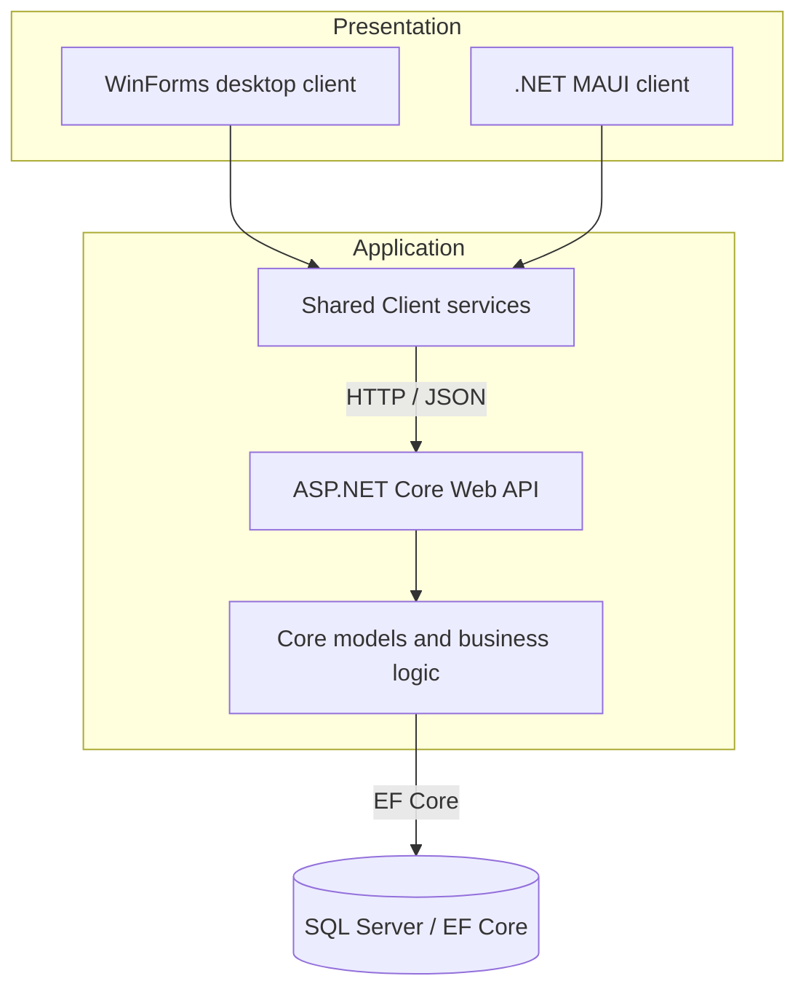
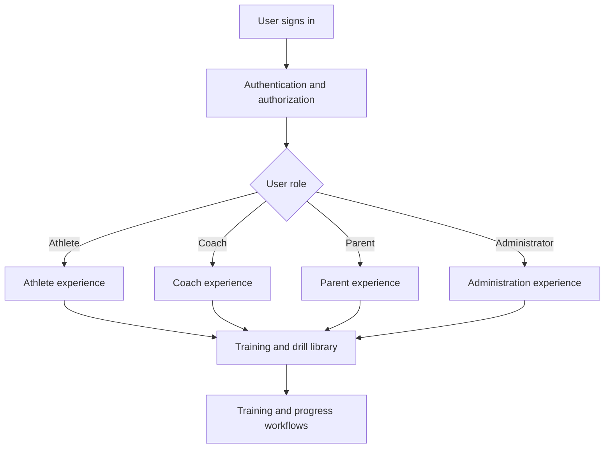
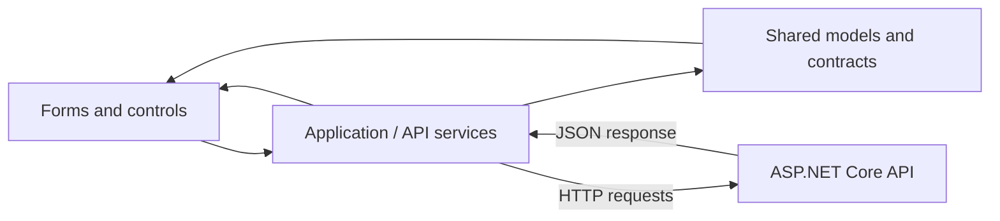
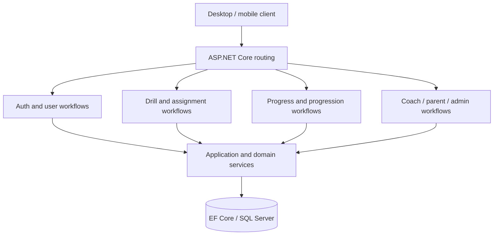
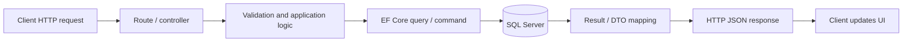
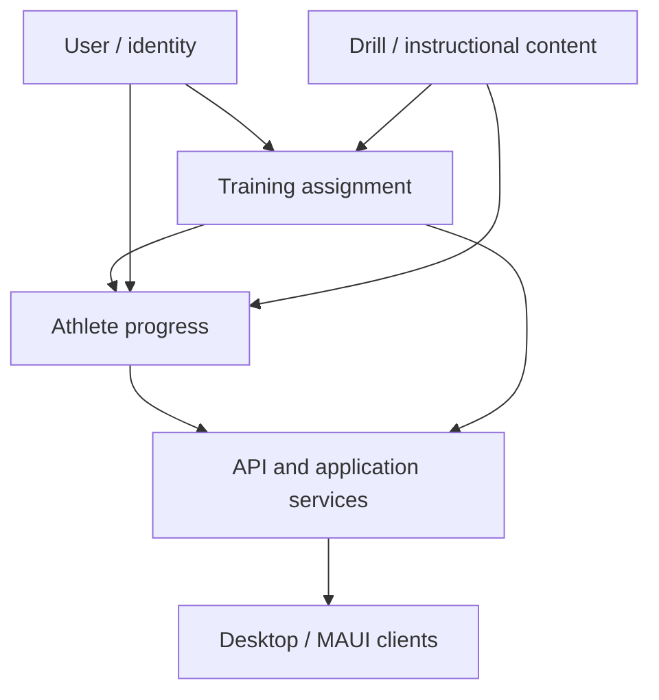
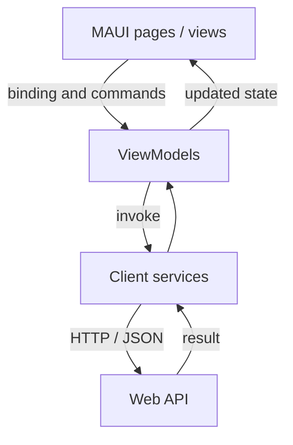
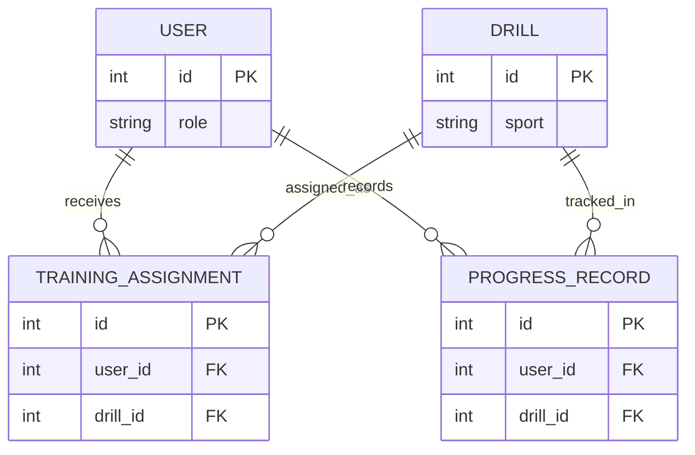
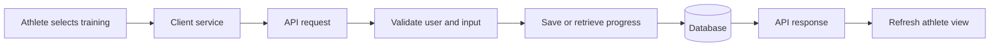

# Skill Builder Pro


**Built for Athletes. Powered by Precision.**

A multi-client athlete development platform built with C# and .NET. Developed by **Bobby Rovy**, a Microsoft Software and Systems Academy (MSSA) Cloud Application Development graduate and U.S. Army veteran.

[GitHub](https://github.com/brovy23-GD) | [LinkedIn](https://www.linkedin.com/in/bobbyrovy) | [Email](mailto:brovy23@gmail.com)

## At a glance

Skill Builder Pro (SBP) explores how athletes, parents, coaches, and administrators can manage structured training through connected applications. The repository includes an ASP.NET Core Web API, shared Core and Client projects, Windows Forms and .NET MAUI clients, SQL Server/Entity Framework Core integration, and a test project. It is an **active portfolio project**; the committed GitHub version may differ from newer work on my local machine.

**Technology:** C# | .NET 10 | ASP.NET Core Web API | Entity Framework Core | SQL Server | WinForms | .NET MAUI | GitHub Actions | Figma

### What problem is SBP designed to address?

Training instructions, athlete progress, and communication can be scattered across videos, spreadsheets, texts, and separate team systems. SBP brings drill discovery, user roles, training assignments, and progress-oriented workflows together in one application architecture. Features and exact counts are evolving; review the checked-in source to determine current behavior.

### Explore the implementation

| Repository path | Area |
| --- | --- |
| [`SkillBuilderPro.API/`](SkillBuilderPro.API/) | API, request handling, and application endpoints |
| [`SkillBuilderPro.Core/`](SkillBuilderPro.Core/) | Domain models and shared backend logic |
| [`SkillBuilderPro.Client/`](SkillBuilderPro.Client/) | Shared client services |
| [`SkillBuilderPro.WinForms/`](SkillBuilderPro.WinForms/) | Windows desktop UI |
| [`SkillBuilderPro.MAUI/`](SkillBuilderPro.MAUI/) | Cross-platform UI project |
| [`SkillBuilderPro.Tests/`](SkillBuilderPro.Tests/) | Tests and coverage configuration |
| [`.github/workflows/dotnet-ci.yml`](.github/workflows/dotnet-ci.yml) | CI configuration; see Actions for actual run status |

---

## Architecture and engineering workflows

The diagrams below **preserve the original README's technical walkthroughs** and are organized for readers who want a deeper engineering view. They are **conceptual or historical illustrations**, not an automatically generated map of every currently checked-in class, route, database column, or runtime behavior. The codebase has evolved since the earliest diagrams were drawn; consult current source and tests for implementation details.

### 1. Multi-client system architecture



This logical view illustrates the separation between user interfaces, reusable client services, API endpoints, domain logic, and persistent data. Actual project references are defined by the solution and project files.

### 2. Role routing and dashboards (conceptual workflow)



This preserves the original role-router design idea without tying it to an obsolete login endpoint or claiming that every screen is fully implemented in each client.

### 3. WinForms component interaction



This diagram conveys the intended separation of UI, services, shared models, and server interaction rather than a literal serialization call sequence.

### 4. API controller architecture



The current repository contains dedicated controllers for authentication, drills, progress, athlete assignments, coaches, parents, schedules, administration, and other functions. See [`SkillBuilderPro.API/Controllers/`](SkillBuilderPro.API/Controllers/) for actual names and routes; the old three-controller diagram is no longer an accurate inventory.

### 5. API request/response lifecycle



Exact status codes, authorization requirements, and persistence behavior depend on the selected endpoint.

### 6. Shared model dependencies



This is a domain-level explanation, not a declaration of exact current EF Core table names or foreign-key columns.

### 7. MAUI MVVM flow



The MAUI project is part of the repository. Individual pages, commands, and features may be in different stages of development.

### 8. Conceptual relational data model



**Conceptual entities only.** Inspect [`SkillBuilderPro.Core/`](SkillBuilderPro.Core/) and EF Core migrations for the current schema; names above are not guaranteed to match actual classes or tables.

### 9. End-to-end athlete training flow



This preserves the original drill-to-progress narrative while avoiding an unverified claim about a particular UI button, route, or response code.

---

## How I use AI to build and improve SBP

I configured a **project-specific AI coding agent** by writing prompts and instructions, testing its recommendations against SBP tasks, and refining those instructions as the codebase evolved. I use **OpenAI Codex** to investigate complex coding problems and help diagnose errors and bugs. I also work with **ChatGPT Projects, Claude Projects, GitHub Copilot, and Perplexity Computer Mode** in research, coding, planning, review, and troubleshooting workflows.

My typical workflow is to reproduce an issue, provide relevant project context, ask for a focused analysis or suggested change, inspect the proposed code, test the affected paths, and refine the solution based on results. **I review and validate changes; using an AI coding agent does not mean SBP deploys a production AI agent to customers.**

I use **Figma** extensively to explore visual direction and user experience, then translate design decisions into application changes and iterate on them.

---

## Local setup and testing

The following is a starting point, not a guarantee that every platform-specific project will run on every machine. Review the project configuration, connection strings, SDK requirements, and local secrets before starting.

```bash
git clone https://github.com/brovy23-GD/Skill-Builder-Pro-.git
cd Skill-Builder-Pro-
dotnet restore SkillBuilderPro.sln
```

For a supported environment, build the projects you intend to run and follow the API's local configuration and database migration setup. WinForms and some MAUI targets require the appropriate OS, workloads, and SDKs.

The repository includes [tests](SkillBuilderPro.Tests/) and a [GitHub Actions workflow](.github/workflows/dotnet-ci.yml). Consult the Actions tab for the latest test and coverage results rather than relying on an unverified "build passing" badge.

## API reference and performance notes

Because API routes and the domain model have evolved, the source of truth for endpoint names, request models, authorization rules, and status codes is the [current controller implementation](SkillBuilderPro.API/Controllers/). Where Swagger/OpenAPI is enabled locally, use it to inspect the running API.

Performance depends on actual query shapes, indexes, dataset size, and environment. An endpoint should not be described as a guaranteed O(1) database operation without profiling and a supporting execution plan.

## Design direction

The original project identity uses performance blue and a dark interface with high-contrast typography, sports-training imagery, and role-oriented experiences. Figma concepts and implementation may evolve separately; see the [design documentation](docs/design/) and [design assets](DesignAssets/) for project materials.

## Status and scope

SBP is an ongoing independently developed portfolio application. This README documents the engineering approach and the code currently represented in the public repository; it does not claim a production enterprise deployment, universal feature completeness, or that local changes have already been pushed to GitHub.

---

**Bobby Rovy** | [LinkedIn](https://www.linkedin.com/in/bobbyrovy) | [GitHub](https://github.com/brovy23-GD) | [Email](mailto:brovy23@gmail.com)
