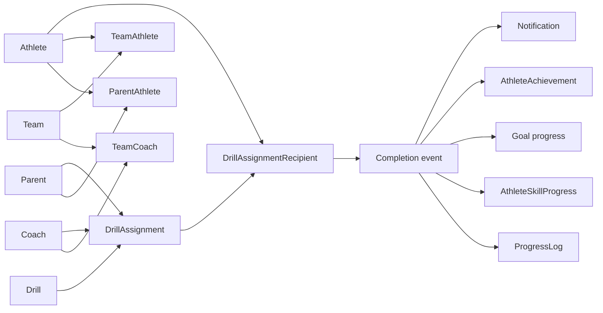

# Phase 5 Architecture Audit

## Scope and current baseline

This report is a read-only architecture design for Parent/Athlete relationships, Coach/Team management, assignments, training requests, completion, progression, goals, achievements, notifications, and a future MAUI Trophy Room.

It builds on the verified repository architecture:

- ASP.NET Core Identity with integer user keys.
- JWT authentication and canonical Athlete, Parent, Coach, and Administrator roles.
- Server-enforced role authorization.
- Owner-scoped `ProgressLog` and `TrainingSchedule` access with Administrator override.
- Authenticated drill reads and Coach/Administrator drill mutations.
- Existing WinForms and MAUI clients, which remain unchanged by this audit.

No existing cross-user isolation should be weakened. Cross-user authority must arise only from explicit server-controlled relationships.

## Architectural direction

`DrillAssignment` should become the authoritative scheduling model. The existing `TrainingSchedule` should remain temporarily for compatibility, then become read-only/deprecated once assignment APIs are established.

## 1. Recommended complete entity model

Initial multi-user entities:

- `ParentAthlete`
- `Team`
- `TeamCoach`
- `TeamAthlete`
- `DrillAssignment`
- `DrillAssignmentRecipient`
- `TrainingRequest`
- `SkillProgressionLevel`
- `AthleteSkillProgress`
- `Goal`
- `AchievementDefinition`
- `AthleteAchievement`
- `Notification`
- `NotificationRecipient`
- `NotificationPreference`

Core services:

- `IRelationshipAccessService`
- `IAssignmentService`
- `ITrainingRequestService`
- `IAssignmentCompletionService`
- `IProgressionService`
- `IGoalProgressService`
- `IAchievementService`
- `INotificationService`

## 2. Relationship cardinality

- Parent ↔ Athlete: many-to-many through `ParentAthlete`.
- Coach ↔ Team: many-to-many through `TeamCoach`.
- Team ↔ Athlete: many-to-many through `TeamAthlete`.
- Drill → Assignment: one-to-many.
- Assignment creator → Assignment: one-to-many.
- Assignment ↔ Athlete: many-to-many through `DrillAssignmentRecipient`.
- Athlete → TrainingRequest: one-to-many.
- Requested-from user → TrainingRequest: one-to-many.
- TrainingRequest → resulting Assignment: zero-or-one.
- Progression level → Athlete skill states: one-to-many.
- Athlete → goals, achievements, and notifications: one-to-many.
- Notification → recipients: one-to-many.

## 3. ParentAthlete design

Fields:

- `ParentUserId` — required FK to `AspNetUsers` and composite key member.
- `AthleteUserId` — required FK and composite key member.
- `IsActive`.
- `CreatedAtUtc`.
- `CreatedByUserId` — required actor establishing the relationship.

Use composite PK `(ParentUserId, AthleteUserId)`, which also prevents duplicates. Add an index on `AthleteUserId`. Use restrictive user-delete behavior so identity deletion cannot silently erase relationship/audit history. Validate Parent and Athlete Identity roles when establishing the link.

## 4. Team design

Initial fields:

- `Id` — PK.
- `Name` — required.
- `Sport` — required and normalized consistently with `Drill.Sport`.
- `Season` — optional.
- `AgeGroup` — optional.
- `Organization` — optional.
- `IsActive`.
- `CreatedAtUtc`.
- `CreatedByUserId` — required FK to Identity.

Index `(Sport, IsActive)`. Add `(Organization, Name)` only when Organization becomes a meaningful boundary. Do not put a permanent `HeadCoachUserId` on Team.

## 5. TeamCoach design

Fields:

- `TeamId`.
- `CoachUserId`.
- `TeamRole`.
- `IsActive`.
- `JoinedAtUtc`.

Use composite PK `(TeamId, CoachUserId)` and index `CoachUserId`. Use FKs to Team and Identity. `TeamRole` belongs on this relationship because the same Coach may serve different roles on different Teams. Initially use constrained string constants (`HeadCoach`, `AssistantCoach`, `SkillsCoach`); introduce a lookup table only if roles become administrator-configurable.

## 6. TeamAthlete roster design

Fields:

- `TeamId`.
- `AthleteUserId`.
- `IsActive`.
- `JoinedAtUtc`.
- `LeftAtUtc` nullable.

Use composite PK `(TeamId, AthleteUserId)` and index `AthleteUserId`. Retain minimal history with active/joined/left state. Do not add a full membership-version system initially. If repeat membership in the same Team/season later requires separate periods, move to a surrogate membership ID.

## 7. Whether CoachAthlete is needed

Not initially. Coach access is derived through active `TeamCoach` and `TeamAthlete` rows. A direct relationship would duplicate authority and risk disagreement. Add it later only if independent one-on-one coaching outside Teams becomes a product requirement.

## 8. DrillAssignment design

Fields:

- `Id` — PK.
- `DrillId` — required FK, delete restricted.
- `AssignedByUserId` — required Identity FK, always from authenticated claims.
- `SourceTeamId` — nullable Team FK for Team-context assignments.
- `ScheduledForUtc` — nullable.
- `DueAtUtc` — nullable.
- `Instructions` — nullable and bounded.
- `Status`.
- `CountsTowardProgression`.
- `CreatedAtUtc`.
- `CancelledAtUtc` nullable.

Indexes: `(AssignedByUserId, CreatedAtUtc)` and `(SourceTeamId, ScheduledForUtc)`. Preserve assignments if the creator or Team is later deactivated.

## 9. DrillAssignmentRecipient design

Fields:

- `AssignmentId`.
- `AthleteUserId`.
- `Status`.
- `StartedAtUtc` nullable.
- `CompletedAtUtc` nullable.
- `AthleteNotes` nullable.
- `Rating` nullable.
- Concurrency token if concurrent updates become likely.

Use composite PK `(AssignmentId, AthleteUserId)`. Add indexes `(AthleteUserId, Status, AssignmentId)` and `(AthleteUserId, CompletedAtUtc)`. This row is the authoritative per-Athlete assignment state.

## 10. Common Parent/Coach assignment engine

Use one `IAssignmentService`. Controllers provide actor context, Drill/scheduling details, selection mode, Team ID, and requested Athlete IDs. The service must derive the actor from JWT, resolve relationship authority server-side, validate every recipient, create one assignment and its recipients in one transaction, then emit events after persistence. Parent and Coach controllers may expose role-appropriate routes but must share this engine.

## 11. Parent managing multiple children

Query active `ParentAthlete` rows using the authenticated Parent ID. Parent identifiers in request bodies or routes are never proof of authority.

## 12. Multiple Parents managing one Athlete

Multiple active join rows are supported. Monitoring and notification recipient resolution include all active linked Parents, filtered through sending and receiving preferences.

## 13. Coach managing multiple Teams

List Teams through active `TeamCoach` rows for the authenticated Coach. One Coach may have different `TeamRole` values across Teams.

## 14. Team supporting multiple Coaches

Multiple `TeamCoach` rows authorize multiple Coaches. Team role describes Team responsibility and must not grant a broader application role.

## 15. Entire-Team assignment flow

1. Authenticate Coach.
2. Verify active `TeamCoach` relationship.
3. Resolve active roster from `TeamAthlete` server-side.
4. Validate the Drill and schedule.
5. Create one `DrillAssignment` with `SourceTeamId`.
6. Materialize a recipient for every current roster Athlete.
7. Commit atomically.
8. Emit assignment-created notifications.

Recipients should be materialized at creation. Athletes who later leave retain the historical assignment; future Team members do not inherit it silently.

## 16. Selected-Athlete assignment flow

The server must verify the Coach manages the referenced Team and every selected Athlete is an active Team member. If one ID is unauthorized, fail the complete request. Atomic failure is safer and easier to reason about than partial success, and the response should avoid disclosing unrelated Athlete details.

## 17. Individual assignment flow

- Coach → Athlete: verify active Coach→Team→Athlete path.
- Parent → child: verify active `ParentAthlete`.
- Administrator: use an explicit administrative path.

An Athlete ID is only a selection input, never authorization evidence.

## 18. Parent multi-child assignment flow

Validate every submitted Athlete against the authenticated Parent’s links. Create one shared assignment with multiple recipients. This prevents duplicated instructions/dates and supports independent completion through recipient rows.

## 19. TrainingRequest model

Fields:

- `Id` — PK.
- `AthleteUserId` — required, taken from JWT.
- `RequestedFromUserId` — required Identity FK.
- `RequestedAtUtc`.
- `Sport`, `Category`, `SkillArea` — optional request context.
- `Notes` — bounded.
- `PreferredScheduledForUtc` nullable.
- `Status`.
- `ReviewedAtUtc` nullable.
- `ResponseNotes` nullable.
- `ResultingAssignmentId` nullable.

Indexes: `(AthleteUserId, RequestedAtUtc)` and `(RequestedFromUserId, Status, RequestedAtUtc)`. Consider a unique filtered index on non-null `ResultingAssignmentId`.

## 20. TrainingRequest status lifecycle

Minimum states: `Pending`, `Approved`, `Declined`, `Cancelled`. Athlete may cancel only their own Pending request. The addressed Parent/Coach may approve or decline Pending requests. Terminal records remain for history. Use concurrency protection for competing review/cancellation actions.

## 21. Athlete-to-Parent request authorization

The requested user must be an active Parent linked through `ParentAthlete` to the authenticated Athlete.

## 22. Athlete-to-Coach request authorization

The requested Coach must manage at least one active Team containing the authenticated Athlete.

## 23. Approval-to-assignment workflow

In one transaction: load a Pending request addressed to the authenticated reviewer, revalidate the relationship, validate the selected Drill, invoke the common assignment service, create the Athlete recipient, link the resulting assignment, set review fields/status, and commit. Emit request-approved and assignment-created events afterward.

## 24. Decline and cancellation

The addressed reviewer may decline Pending requests; the requesting Athlete may cancel their own Pending request. Preserve response notes and history. Approved, Declined, and Cancelled are terminal initially.

## 25. TrainingRequest notification flow

Publish application events for created, approved, declined, and cancelled requests. Handlers create in-app notifications and future delivery work; controllers do not invoke channel providers.

## 26. Per-Athlete assignment completion

Completion state belongs to each `DrillAssignmentRecipient`, ensuring one recipient’s completion never globally completes an assignment shared by many Athletes.

## 27. Recipient versus separate completion entity

Keep status, timestamps, notes, and rating on the recipient initially. Add an `AssignmentAttempt` entity only when multiple attempts, immutable attempt history, or detailed telemetry is required.

## 28. Assignment and recipient lifecycles

Assignment: `Scheduled`, `Active`, `Cancelled`, `Closed`.

Recipient: `Assigned`, `InProgress`, `Completed`, `Missed`, `Excused`.

Close an assignment through a service rule when no recipients remain actionable; never close it merely because one Athlete completed it.

## 29. Athlete completion-notification preferences

Do not add booleans to `ApplicationUser`. Store Athlete-scoped preferences for event `AssignmentCompleted` and audience Parent/Coach, allowing Parents only, Coaches only, both, or neither. Guardian policy overrides for minors can be added later.

## 30. Parent/Coach receiving preferences

Use `NotificationPreference(UserId, EventType, Channel, IsEnabled)` with unique constraint `(UserId, EventType, Channel)`. Add quiet hours/time zones only later.

## 31. Authorized notification-recipient resolution

Resolve active Parents and Coaches through relationship tables, remove duplicates, apply Athlete audience preferences, then each recipient’s channel preferences. Never use client-submitted notification-recipient lists.

## 32. Progress-monitoring authorization

- Athlete: own records.
- Parent: records of active linked Athletes.
- Coach: records of Athletes on actively coached Teams.
- Administrator: broad access.
- Everyone else: `404` where existence should not be disclosed.

## 33. Relationship-access service architecture

Introduce `IRelationshipAccessService` with operations such as `CanAccessAthleteAsync`, `CanManageTeamAsync`, `GetAccessibleAthleteIdsAsync`, `ValidateAssignmentRecipientsAsync`, and `GetCompletionNotificationAudienceAsync`. Authorization handlers and services should call it instead of duplicating joins.

## 34. Existing Progress ownership evolution

Replace the current nullable owner scope (`null` means Administrator/all) with an explicit `AthleteAccessScope` containing actor, administrative status, and permitted Athlete IDs. Keep query filtering in the database and preserve current non-disclosure behavior.

## 35. Existing Schedule ownership evolution

Apply the same relationship-aware scope temporarily. Do not broaden Schedule collection queries ad hoc. New multi-user scheduling should move to assignments.

## 36. TrainingSchedule versus DrillAssignment

`TrainingSchedule` cannot represent creator, Team context, multiple recipients, instructions, or per-Athlete completion. Maintaining both as writable sources would create conflicting statuses and duplicate calendar entries.

## 37. Recommended scheduling source of truth

Make `DrillAssignment` authoritative. Keep legacy Schedule APIs temporarily, migrate meaningful owned records where possible, then mark legacy writes deprecated/read-only. Do not indefinitely dual-write assignments and schedules.

## 38. Skill progression model

Use `SkillProgressionLevel` definitions plus `AthleteSkillProgress` state. Align definitions with existing `Drill.Sport`, `Category`, `DrillGroup`, and `SubCategory` taxonomy.

## 39. SkillProgressionLevel

Fields:

- `Id`.
- `Sport`, `Category`, optional `SkillArea`.
- `LevelNumber`, `Name`.
- `RequiredCompletions`.
- `MinimumRating` nullable.
- `RequireDistinctDrills`.
- `IsActive`.

Unique `(Sport, Category, SkillArea, LevelNumber)` and index `(Sport, Category, IsActive)`. Defer approval requirements until those workflows are concrete.

## 40. AthleteSkillProgress

Fields: `AthleteUserId`, `SkillProgressionLevelId`, `StartedAtUtc`, nullable `CompletedAtUtc`, `QualifyingCompletionCount`, and concurrency token. Use composite PK `(AthleteUserId, SkillProgressionLevelId)`. Derive current level from completed/active levels rather than duplicating it.

## 41. Qualifying completion rules

A recipient completion counts only if the Athlete matches, recipient is Completed, assignment opts into progression, Drill taxonomy matches, rating criteria pass, and that completion has not already been processed. Use an idempotency/evidence record so retries cannot double-count.

## 42. Repeat-drill handling

Make repeat policy configurable. Default to distinct assignment-recipient completions; when `RequireDistinctDrills` is enabled, count a Drill once per level. Avoid universally permitting one Drill to be farmed or universally banning purposeful repetition.

## 43. Level-up workflow

Recipient completion publishes an event; progression evaluates matching levels, records qualifying evidence, completes the level, derives/unlocks the next, awards achievements, updates system goals, and creates notifications.

## 44. Event/service-driven progression

Yes. Controllers issue completion commands only. Progression, goals, achievements, and notifications run in idempotent application-event handlers that can later move from in-process dispatch to a durable queue/outbox.

## 45. Goal entity architecture

Use one `Goal` entity with `Id`, `AthleteUserId`, nullable `CreatedByUserId`, `GoalType`, title/description, target/current values, start/due/completion dates, status, and optional progression reference. Index `(AthleteUserId, Status, DueAtUtc)` and `(CreatedByUserId, Status)`.

## 46. System goals

Use `GoalType = System`, nullable creator, and data-driven creation from progression rules.

## 47. Parent/Coach goals

Use `GoalType = Assigned`. Validate the relationship at creation and modification time; the authenticated creator ID is server-assigned.

## 48. Athlete personal goals

Use `GoalType = Personal`; Athlete identity comes from JWT. Permit only safe Athlete-editable fields.

## 49. AchievementDefinition

Fields: `Id`, unique `Code`, `Name`, `Description`, `Category`, optional `Threshold`, `IconKey`, `IsSecret`, and `IsActive`. MAUI should render definitions and branded assets rather than hard-code achievement logic.

## 50. AthleteAchievement

Fields: `AthleteUserId`, `AchievementDefinitionId`, `AwardedAtUtc`, `SourceType`, and optional `SourceId`. A composite key works for one-time achievements; use a surrogate ID if repeatable achievements are introduced.

## 51. Training streaks

Derive streaks from dated qualifying completions. Later maintain a rebuildable summary projection for current/longest streak rather than using a mutable counter as truth.

## 52. Trophy Room API needs

Provide composed read models for Athlete profile, current skill levels, next-level progress, active/completed goals, earned/locked achievements, recent level-ups, completion totals, and streaks. Use one initial-load summary endpoint plus paginated detail endpoints.

## 53. Assignment completion and ProgressLog

Recipient completion is authoritative for assigned-work completion. A completion event may create one linked `ProgressLog` for performance history. Add a source linkage and uniqueness rule to prevent duplicate logs. Manual Progress entries should have a distinct source type.

## 54. Completion and skill progression

Progression consumes qualifying recipient-completion events, not arbitrary `ProgressLog` inserts, preventing manual entries from accidentally leveling up.

## 55. Completion and goals

Goal handlers update only matching rule-backed goals and must be idempotent.

## 56. Level-up and achievements

A `SkillLevelCompleted` event awards the applicable achievement and creates notifications; controllers do not do this directly.

## 57. Assigned-versus-completed/adherence architecture

Materialized recipients support assigned count, completed count, completion percentage, overdue/missed work, time to completion, adherence by Athlete/Team/Coach, and historically accurate roster reporting.

## 58. Notification entities

`Notification`: `Id`, event type, subject/body, related entity type/ID, creation time, optional scheduled delivery time.

`NotificationRecipient`: notification, user, channel, delivery status, sent/read times, failure information.

`NotificationPreference`: user, event type, channel, enabled.

## 59. Future SMS architecture

An `ISmsSender` receives already-authorized delivery work. It never selects recipients. Use verified phone/contact data and opt-in preferences. No provider should be selected during initial architecture implementation.

## 60. Future push architecture

Use `IPushNotificationSender` plus separate registered device-token records with revocation and last-seen metadata.

## 61. Future email architecture

Use `IEmailNotificationSender` with confirmed Identity email or separately verified contact records and preference enforcement.

## 62. In-app notification architecture

Implement this channel first using persistent recipient rows. Expose unread count, paginated listing, and mark-read endpoints.

## 63. Background/scheduled-job architecture

Initially persist notification/delivery work and use an ASP.NET Core `BackgroundService` to claim and process due rows with bounded retries. Later move to an outbox and durable queue/job system. External calls never occur directly inside completion/assignment HTTP requests.

## 64. Notification/contact preferences

Keep verified contact methods separate from delivery preferences. Support event/channel opt-in, Athlete audience preferences, and later quiet hours/time zones. Default external channels conservatively.

## 65. Recommended API endpoints

Parents:

- `GET /api/parent/athletes`
- `GET /api/parent/athletes/{athleteId}/progress`
- `GET /api/parent/athletes/{athleteId}/assignments`
- `GET /api/parent/athletes/{athleteId}/progression`
- `GET /api/parent/athletes/{athleteId}/goals`
- `POST /api/parent/assignments`
- `POST /api/parent/athletes/{athleteId}/goals`

Coaches:

- `GET /api/coach/teams`
- `GET /api/coach/teams/{teamId}`
- `GET /api/coach/teams/{teamId}/roster`
- `GET /api/coach/athletes/{athleteId}/progress`
- `GET /api/coach/athletes/{athleteId}/progression`
- `GET /api/coach/athletes/{athleteId}/goals`
- `POST /api/coach/teams/{teamId}/assignments`
- `POST /api/coach/teams/{teamId}/assignments/selected`
- `POST /api/coach/athletes/{athleteId}/assignments`
- `GET /api/coach/training-requests`
- `POST /api/coach/training-requests/{id}/approve`
- `POST /api/coach/training-requests/{id}/decline`

Athletes:

- `GET /api/athlete/assignments`
- `GET /api/athlete/assignments/{id}`
- `POST /api/athlete/assignments/{id}/start`
- `POST /api/athlete/assignments/{id}/complete`
- `GET /api/athlete/goals`
- `POST /api/athlete/goals`
- `GET /api/athlete/progression`
- `GET /api/athlete/achievements`
- `POST /api/athlete/training-requests`
- `GET /api/athlete/training-requests`
- `POST /api/athlete/training-requests/{id}/cancel`

Administrators:

- `/api/admin/relationships/parent-athletes`
- `/api/admin/teams`
- `/api/admin/teams/{id}/coaches`
- `/api/admin/teams/{id}/roster`
- `/api/admin/progression-levels`
- `/api/admin/achievement-definitions`

## 66. Authorization policy

Apply role policies at endpoints and resource/relationship checks in centralized services or authorization handlers. Revalidate relationships on every cross-user operation. Use `404` for inaccessible IDs when existence disclosure is unnecessary. Never trust Parent, Coach, Athlete, Team, assigner, owner, or role values merely because a client submits them. Administrator bypass must be explicit and auditable.

## 67. Secure relationship creation

The safest practical first implementation is Administrator-controlled linking and roster management with creator/time audit fields. Later introduce single-use expiring invitations bound to authenticated accounts, expected roles, and relationship context. Reusable public codes must never alone establish Parent or Coach authority.

## 68. Existing files likely to change

Core: `ApplicationUser.cs`, `AppDbContext.cs`, `ProgressLog.cs`, `TrainingSchedule.cs` during transition, `Drill.cs`, service interfaces, snapshots, and migrations.

API: `Program.cs`, Progress/Schedule controllers and services, current-user/access abstractions, policy registration, and new role-specific controllers/contracts.

The shared MAUI client will later need authenticated PUT/PATCH/DELETE, typed error handling, pagination, and Trophy Room DTOs; it currently supports only GET/POST and suppresses failures.

## 69. New files/classes likely required

Add the proposed entities, DTOs, controllers, relationship/assignment/request/completion/progression/goal/achievement/notification services, authorization requirements/handlers, and application event abstractions. Keep entity types out of public API contracts.

## 70. Required migrations

Use separate reviewed migrations for:

1. Parent and Team relationships.
2. Assignments and recipients.
3. Training requests.
4. Progress/completion source linkage.
5. Progression definitions and Athlete state.
6. Goals.
7. Achievements.
8. Notifications/preferences.

Do not auto-link existing users, delete existing tables, or arbitrarily associate existing Progress/Schedule data.

## 71. Risks to existing functionality

- WinForms local identities are not Identity accounts and cannot join server relationships until client migration.
- Existing unowned records remain Administrator-only.
- `UserProfile.Team` and `Goal` strings conflict conceptually with normalized entities.
- WinForms `Admin` differs from canonical `Administrator`.
- MAUI/shared API clients currently hide authorization/validation errors.
- Drill taxonomy strings may contain inconsistent values.

## 72. Risks to ownership authorization

The current convention where nullable owner scope means unrestricted Administrator access is fragile. Replace it with an explicit access-scope object before adding cross-user reads. Relationship revocation must immediately affect access, and current `404` non-disclosure behavior should remain.

## 73. Risks of duplicate scheduling models

Two writable models would produce conflicting statuses, duplicate calendars, divergent completion, notification errors, and unreliable adherence metrics. Assignments must become authoritative.

## 74. Risks of duplicate Progress/completion data

If assignment completion and `ProgressLog` independently drive progression, counts can double and event retries can level an Athlete twice. Recipient completion must be authoritative; generated Progress records require source linkage and idempotency.

## 75. Recommended implementation order

1. Central relationship-access and explicit access-scope abstractions.
2. `ParentAthlete`, `Team`, `TeamCoach`, and `TeamAthlete`.
3. Administrator-only relationship/Team management APIs.
4. Read-only Parent child and Coach Team/roster APIs.
5. Assignment and recipient model plus common assignment service.
6. Parent/Coach assignment APIs.
7. Athlete assignment listing and completion.
8. Assignment/completion application events.
9. Training requests and approval-to-assignment workflow.
10. In-app notifications and preferences.
11. Relationship-aware Progress access.
12. Deprecate `TrainingSchedule` as writable source.
13. Progression definitions and Athlete progress.
14. Goals and event-driven updates.
15. Achievements and streak projections.
16. Trophy Room read APIs.
17. MAUI authentication/client modernization.
18. Responsive MAUI assignments, requests, and Trophy Room UI.
19. External push/email/SMS only after consent and durable delivery infrastructure.

This sequence preserves verified isolation while introducing explicit, auditable cross-user authority and reusable domain services.
